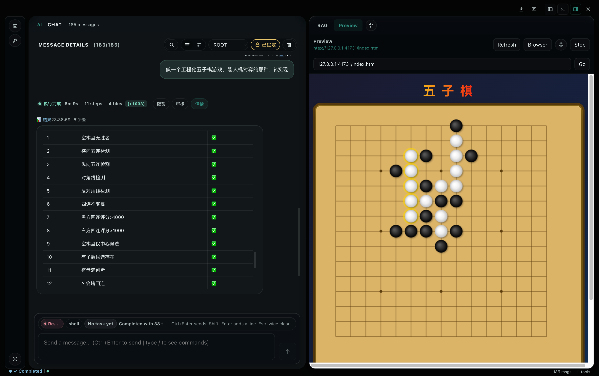
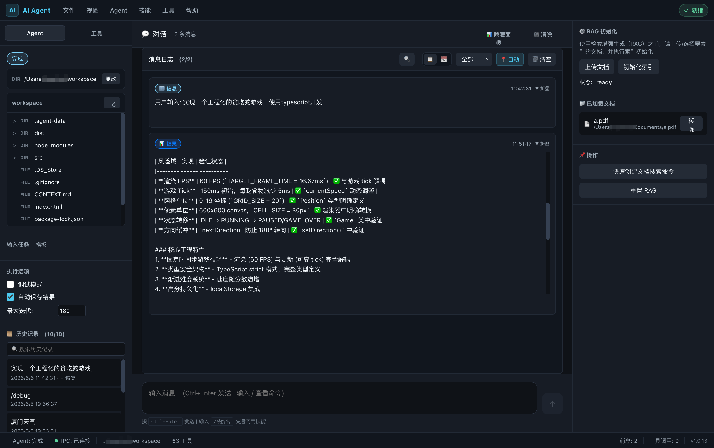
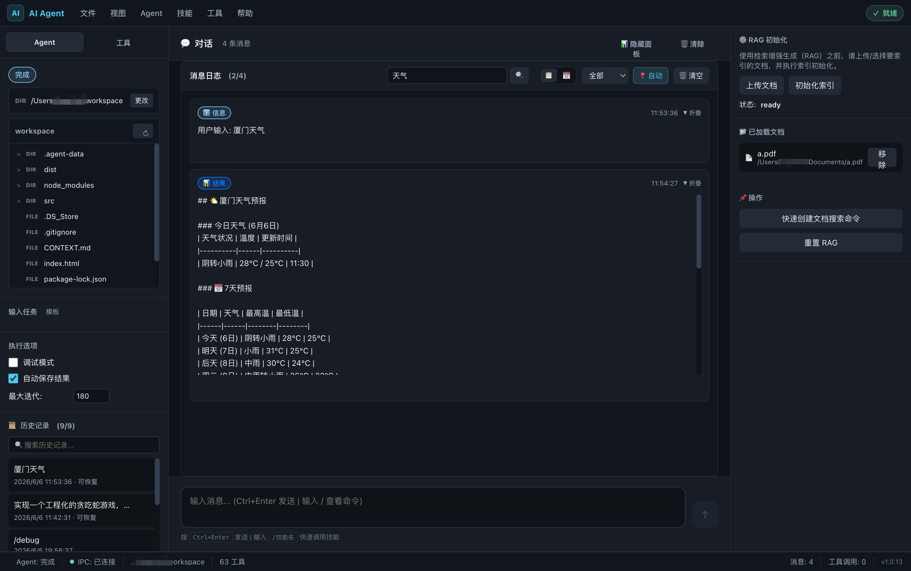
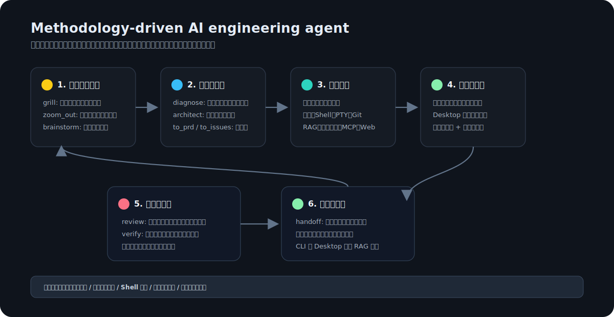

# AI Engineering Mastery Agent

AI Engineering Mastery Agent 是一个本地运行的 AI 工程助手，面向真实项目里的代码阅读、修改、验证、文档检索和日常排障。它同时提供 CLI 和 Desktop 两种入口：终端里足够快，桌面端更适合持续对话、浏览项目文件和管理文档知识库。

它的核心体验不是“问模型一个答案”，而是让 Agent 按工程方法论推进任务：先理解系统和风险，再选择合适工具，修改最小必要范围，最后用测试、构建、日志或人工可检查证据验证结果。





## 它和其他 AI Code Agent 的区别

AI Engineering Mastery Agent 更像一个带方法论的本地工程协作者，而不是只会补全代码的聊天框。它把“怎么思考”和“能调用什么工具”都显式放进运行流程里。



核心差异：

- 方法论工具：`coverage_check`、`ask_user`、`grill`、`zoom_out`、`diagnose`、`brainstorm`、`tdd`、`review`、`verify`、`architect`、`to_prd`、`to_issues`、`handoff`。
- 工程工具：文件读写、Shell、PTY、Git、文档 RAG、语义搜索、MCP、Web 搜索、本地代码预览。
- 工程闭环：需求对齐、系统分析、执行、观察、审查、验证、交付摘要。
- 本地体验：项目隔离的文档索引和历史会话，CLI/Desktop 共享 RAG，Desktop 可观察每轮执行过程。

## 工具系统

Agent 的工具不是简单堆在提示词里，而是按任务动态选择和约束。复杂任务会优先暴露当前真正需要的工具，降低模型误用工具、重复调用或跑偏的概率；涉及 RAG/Web 回答时，会先用 `coverage_check` 判断证据是否足够，并把缺口转成检索动作；如果缺的是用户掌握的业务约束、验收标准或确认信息，会用 `ask_user` 中断本轮并请你补充；涉及写文件、运行命令和访问工作区外路径时，会经过安全策略和上下文预算控制。

## 你可以用它做什么

- 让 Agent 阅读项目代码，定位问题，修改文件，并运行测试或构建命令验证结果。
- 把 PDF、DOCX、Markdown、HTML、JSON、文本文件或网页加入文档知识库，再按自然语言检索和提问。
- 在 Desktop 里查看工作目录文件树，上传文档，跟随文件变更自动刷新，并在每轮对话中查看独立的 Agent 执行过程。
- 在 CLI 里用 `/doc`、`/preview`、`/debug` 等命令快速完成文档检索、代码预览、诊断和终端协作。
- 连接不同模型 Provider，包括 OpenAI、DeepSeek、Zhipu、Llama、OpenRouter 等。
- 按需使用 Web 搜索、Shell、PTY、文件读写、语义搜索、Git 只读/写入、MCP 等工具。

## 使用体验

### Desktop

Desktop 适合日常连续使用。你可以打开一个工作目录，然后在同一个窗口里完成对话、浏览项目文件、上传文档、观察工具执行结果。

- 工作目录文件树支持展开、折叠、手动刷新和系统文件变更自动刷新。
- RAG 面板使用和 CLI 相同的文档索引，上传后会持久化，重启应用后仍可继续检索。
- 每轮对话都有独立的执行过程面板，状态更新以进度条呈现，工具调用、调试信息和事件详情可以展开查看。
- 历史记录可以恢复到之前的对话，也可以一键清空历史和可恢复会话。
- HTML 页面和 Node Web 项目可以在右侧预览面板中打开，使用本地 localhost 服务承载，支持刷新、浏览器打开和停止预览。
- Agent 消息、工具调用和关键事件会进入对应对话轮次，长内容可以滚动查看。
- 对话窗口和文件区域独立滚动，适合边看项目结构边让 Agent 处理任务。

### 这次版本的重点

- Desktop 的执行过程按对话轮次拆分，不再把多轮任务日志混在同一个框里。
- 状态更新从块状消息改为执行过程里的进度条和状态文案，主问答视角更稳定。
- 历史记录支持恢复和清空；清空时会同时移除本地保存的会话快照。
- 工作目录文件树、RAG 持久化、调试命令和文档搜索继续保持 CLI/Desktop 一致。

### CLI

CLI 适合习惯终端的工程任务。它启动轻、响应快，可以直接在当前目录里让 Agent 读文件、跑命令、改代码和搜索文档。

常用入口：

```text
/doc init
/doc add ./docs/spec.pdf
/doc search "回滚策略"
/doc list
/preview index.html
/preview node . "npm run dev"
/debug on
```

自然语言也可以直接触发文档索引：

```text
根据 @./docs/spec.pdf 总结上线风险
对比 @"./docs/Product Requirements.docx" 和当前实现
读一下 @https://example.com/runbook.html，告诉我部署失败怎么恢复
```

## 典型工作流

### 修复代码问题

```text
帮我审计这个项目里可能严重影响性能的部分，修复后跑测试验证。
```

Agent 会先理解仓库上下文，再选择需要的文件、终端、语义搜索或方法论工具。完成后会说明改了什么、验证了什么，以及仍然存在的风险。

### 用文档辅助开发

```text
/doc add ./docs/api-design.pdf
/doc search "鉴权失败时的错误码"
```

文档会被切分、索引并保存到当前项目的本地知识库。之后你可以继续追问，或者让 Agent 将文档要求和代码实现对照起来。

### 桌面端持续协作

打开 Desktop 后选择项目目录，文件树会显示当前项目。你可以在 Finder 或资源管理器里新增、删除、移动文件，桌面端会自动刷新；也可以在对话中让 Agent 修改项目并观察相关事件。

## 文档知识库

文档 RAG 是 CLI 和 Desktop 共享的能力。它会按工作目录隔离索引，避免不同项目的知识混在一起。

支持来源：

- 本地文件：`.txt`、`.md`、`.json`、`.html`、`.pdf`、`.docx`
- 网络文档：`http(s)` URL
- 对话中的 `@路径` 或显式 `/doc add`

常用命令：

```text
/doc init
/doc add ./docs/spec.pdf
/doc add "docs/Product Requirements.docx"
/doc add https://example.com/runbook.html
/doc search "审批流程"
/doc list
/doc clear
/doc clear <document-id>
```

说明：

- `/doc add` 不带参数时，macOS 会弹出 Finder 文件选择器；其他环境会提示输入路径或 URL。
- 路径包含空格时，建议使用引号，例如 `/doc add "docs/Product Requirements.docx"`。
- 单个文档默认限制 15MB。
- 文档索引会保存在当前工作目录下，重启 CLI 或 Desktop 后自动加载。

## 代码预览

业界常见做法有两类：VS Code/Codespaces 这类本地或云 IDE 通常启动 dev server，再把 localhost/转发端口放进预览面板；StackBlitz/WebContainers 这类浏览器 IDE 会在浏览器内运行 Node runtime。这个项目是本地 CLI/Desktop，所以采用第一种：工作区内 HTML 走本地静态 HTTP 服务，Node 项目走本机 dev server，并把 URL 返回给 CLI 或嵌入 Desktop 预览面板。

常用命令：

```text
/preview index.html
/preview .
/preview node . "npm run dev"
/preview list
/preview stop <session-id>
```

说明：

- HTML 不直接用 `file://` 打开，而是通过 `127.0.0.1` 静态服务预览，资源路径和模块脚本更接近真实浏览器环境。
- Node 项目会优先使用 `package.json` 中的 `dev`、`start`、`preview` 或 `serve` 脚本，也可以显式传入命令。
- 预览服务只允许访问当前工作目录内的文件；Desktop 只允许加载本地预览 URL，不会放开任意外部站点。

## 工程守门

Agent 会尽量按照工程任务的节奏工作：

1. 先理解目标和上下文。
2. 选择必要工具，不把无关工具暴露给模型。
3. 小步修改，只改完成任务需要的内容。
4. 对代码变更运行测试、lint、构建或等价验证。
5. 最后说明变更、验证结果和残留风险。

你不需要记住这些工具名，直接描述任务即可。Agent 会根据任务复杂度决定是直接执行，还是先调用方法论工具把目标、风险和验证标准讲清楚。

## 安装与启动

```bash
git clone <repo-url>
cd ai-engineering-mastery-agent
bun install
cp .env.example .env
```

编辑 `.env` 后填入需要的模型 Provider 配置。

启动 CLI：

```bash
bun run start
```

启动 Desktop 开发模式：

```bash
npm run desktop:dev
```

构建发布产物：

```bash
npm run build:cli
npm run desktop:build:all
npm run build:all
```

CLI 和 Desktop 的 release 产物会分别输出到独立目录，方便按平台分发。

### macOS 首次打开

macOS 用户下载 Desktop 版后，如果看到“应用已损坏，无法打开，你应该将它移到废纸篓”，通常不是文件真的损坏，而是当前社区构建没有完成 Apple Developer ID 签名和 notarization 公证，被 Gatekeeper 拦截了。

推荐先确认来源是本项目的 GitHub Release，并优先下载与你的芯片匹配的包：

- Apple Silicon：`arm64.dmg`
- Intel Mac：`x64.dmg`

如果你信任这个下载来源，可以在安装到 `/Applications` 后临时移除隔离标记：

```bash
xattr -dr com.apple.quarantine "/Applications/AI Engineering Mastery Agent.app"
```

然后再从 Finder 或 Launchpad 打开应用。后续如果发布流程接入正式签名和公证，这一步就不再需要。

## 模型配置

项目支持多 Provider。你可以在 `.env` 中配置不同模型和 API Key，按自己的成本、上下文窗口和响应速度偏好选择。

常见配置项包括：

```env
OPENAI_API_KEY=
DEEPSEEK_API_KEY=
ZHIPU_API_KEY=
OPENROUTER_API_KEY=
MODEL=
DEBUG=false
```

如果使用未知或私有模型，可以通过环境变量覆盖上下文窗口大小，避免长会话时过早或过晚裁剪上下文。

## 本地安全

Agent 默认在你的本地工作目录里运行。它可以读写文件、运行命令和调用模型 Provider，所以建议只在你信任的项目目录中使用。

可选 Shell 沙箱：

```env
AGENT_SHELL_SANDBOX=true
AGENT_SHELL_SANDBOX_BACKEND=auto
AGENT_SHELL_SANDBOX_FAIL_IF_UNAVAILABLE=true
AGENT_SANDBOX_ALLOW_WRITE=.
AGENT_SANDBOX_NETWORK=false
```

沙箱会尽量限制工作区外写入、敏感路径访问和不必要的网络命令。不同系统可用能力不同：macOS 优先 Seatbelt，Linux 优先 bubblewrap，其他环境会退化为策略预检。

## 给开发者

日常验证命令：

```bash
bun run lint
bun test-integration.mjs
bun test tests/e2e/desktop-integration.test.js
npm run desktop:renderer:build
```

代码主要分为两个入口：

- `src/`：CLI、Agent 核心、工具、模型、RAG、调度和安全策略。
- `desktop/`：Electron 主进程、预加载脚本、渲染层和桌面集成。

这里保留的是开发入口，而不是完整源码目录说明。更细的模块关系建议直接从测试和对应功能入口读起。

## 已知限制

- macOS Desktop 产物目前可能触发 Gatekeeper 提示，需要按“macOS 首次打开”里的方式处理；这属于发布签名/公证问题，不代表应用包一定损坏。
- 文档解析依赖本地运行环境，PDF 渲染相关原生依赖缺失时可能需要安装或使用 fallback。
- Shell 沙箱不是所有平台都能提供同等级隔离，生产级隔离建议配合容器或 VM。
- Web 搜索结果受搜索服务和网络环境影响，实时信息应优先查看来源链接。
- 大型仓库、超大文档或大量文件变更会消耗更多索引和刷新时间。

## License

MIT
