# Mastery 系统架构

> 状态：Maintained  
> 架构风格：本地优先、事件驱动、端口适配器式模块化单体 + 进程外 Agent Runtime  
> 适用版本：`package.json` 当前主线  
> 验证入口：`bun run verify`

本文同时描述 Current Architecture（已实现）与 Target Architecture（演进目标）。带 `Target` 标记的组件不得被描述为现有能力；每个目标都必须有迁移阶段和退出条件。运行代码是行为真相来源，本文是设计意图和允许依赖的真相来源。

实现状态统一使用三种口径：`完成` 表示退出条件已有自动化证据；`进行中` 表示基础能力存在但仍有明确缺口；`Target` 表示尚未进入当前行为契约。图中的逻辑组件不代表独立进程或可部署单元，除非图上明确画出进程边界。

界面按钮到能力、命令和反馈的完整映射见 [UI Action Graph](./ui-action-graph.md)。它是本文的交互层配套设计，必须与可执行 Action Registry 保持同步。

## 1. 目标、约束与非目标

### 1.1 设计目标

| 质量属性 | 目标 | 设计响应 | 验证方式 |
| --- | --- | --- | --- |
| 安全性 | Renderer 被攻陷时不能直接获得 Node、文件系统或任意 IPC 能力 | `sandbox: true`、`contextIsolation: true`、Preload 白名单、主进程校验 | Desktop 安全配置测试、Renderer 边界测试 |
| 可恢复性 | 单次 Agent、工具、预览或 UI 故障不破坏整个工作台 | 生命周期状态机、面板级错误、根级错误边界、初始化失败清理 | 生命周期与错误路径测试 |
| 响应性 | 流式输出不因高频 IPC 更新阻塞交互 | 增量事件、Renderer 批处理、折叠历史消息 | Runtime 测试、生产构建、真实页面检查 |
| 可演进性 | OMP 协议、Electron API 与 React UI 可以独立变化 | Adapter、RuntimeEvent、Preload Contract 三个防腐层 | 架构契约测试 |
| 可诊断性 | 启动、IPC、Agent 和能力故障能够定位到边界 | 结构化状态、诊断 handler、有限事件缓冲 | `ipc:diagnose`、状态与事件测试 |
| 本地优先 | 源码、会话和设置默认保留在用户设备 | 文件系统为工作区真相来源；无服务端控制平面 | 数据所有权审查 |

### 1.2 约束

- Electron 主进程是本地特权边界，Renderer 必须视为不可信。
- OMP 以独立子进程运行，Desktop 不依赖其内部 JavaScript 对象。
- CLI 是直接启动 OMP CLI 的薄代理；Desktop 才使用 `OmpAdapter`。
- EventBus 和事件缓冲均为单进程、易失性机制，不提供事务、持久重放或 exactly-once。
- 当前是单用户、单设备、单主窗口架构；不承诺跨设备同步和多窗口一致性。

### 1.3 非目标

- 不定义 OMP 内部推理、工具调度和 Provider 算法。
- 不提供远程多租户控制平面、服务器端会话存储或分布式任务队列。
- 不把浏览器预览视为 Electron 安全和 IPC 行为的等价测试环境。
- 不在本文维护逐个 React 组件的视觉规格；UI 细节属于设计系统和组件契约。

## 2. 架构北极星

Mastery 的目标不是把本地应用拆成微服务，而是在一个部署单元内形成清晰的逻辑平面、可替换端口和可演进协议。只有 OMP、Preview、Terminal 等需要故障或权限隔离的能力运行在独立进程中。

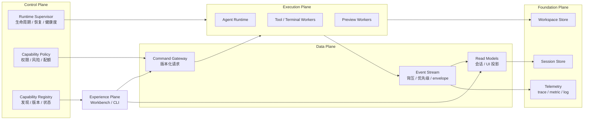

### 2.1 平面职责

| 平面 | 职责 | 当前实现 | Target |
| --- | --- | --- | --- |
| Experience | 输入、展示、交互恢复 | React Workbench、CLI | capability-driven UI，不感知进程位置 |
| Control | 生命周期、策略、能力健康度 | `DesktopCore`、Runtime Supervisor、Capability Registry、基础 Policy Engine | 交互式授权、策略 profile、统一健康度编排 |
| Data | 命令、事件、读模型 | fail-closed IPC contract、RuntimeEvent、ConversationTurn 投影 | 细粒度 schema、背压、可重建 projection |
| Execution | Agent、工具、终端、预览执行 | OMP 子进程、一次性 Terminal command；内置 Preview runner 已移除 | 统一 Worker lifecycle 与隔离等级 |
| Foundation | 工作区、会话、安全存储、遥测 | 文件系统、safeStorage、局部指标 | correlation-aware telemetry、schema migration |

### 2.2 设计不变量

1. **Local-first，不等于 local-only。** 数据权威默认在本机，但所有端口必须允许未来接入远程实现。
2. **Contract-first。** 跨进程数据先定义 schema、版本、错误语义和兼容策略，再实现 handler。
3. **CQRS-lite。** 改变状态使用 Command；高频事实使用 Event；UI 查询稳定 Read Model，三者不混用。
4. **Supervised execution。** 独立进程必须有健康状态、终止语义、重启预算和熔断边界。
5. **Capability-oriented modularity。** Workspace、Session、Runtime、Preview、Terminal 按能力垂直切片，而不是按技术层无限横向堆积。
6. **Observability by construction。** request、event、tool run 从创建时携带 correlation/causation 上下文，而不是出故障后拼接日志。
7. **Backpressure over buffering。** 高频流优先合并、采样或降级；不能靠无限队列掩盖消费者跟不上。
8. **Least authority。** UI 只能请求能力，权限判断和路径约束必须在可信执行边界完成。

### 2.3 Current → Target 演进

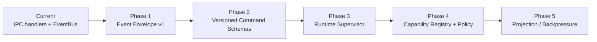

| 阶段 | 状态 | 已有能力 | 尚未满足的退出条件 |
| --- | --- | --- | --- |
| Phase 1 | 完成 | Event Envelope v1：`schemaVersion`、`sequence`、`correlationId`、`causationId` | 无；兼容性与顺序契约已有测试 |
| Phase 2 | 进行中 | 直接与动态 IPC command 均 fail closed；具备版本、风险和结构化可传输结果校验 | 部分 channel 仍使用通用 object validator，尚未完成逐字段输入/输出 schema |
| Phase 3 | 完成 | OMP Runtime Supervisor、并发启动合并、异常退出恢复、重启预算、Engine 重绑 | 无；恢复闭环已有可执行测试 |
| Phase 4 | 进行中 | Capability Registry、基础 Policy Engine、`capabilities:list` / `contracts:list`、Renderer discovery | Policy 尚未消费 capability 实时状态，也没有逐次 consent 和团队策略 profile |
| Phase 5 | 进行中 | ConversationTurn / ToolRun 展示投影、增量文本批处理、确定性折叠策略 | projection rebuild、明确 stream QoS、压力预算和消息虚拟化尚未完成 |

Phase 状态描述实现成熟度，而不是文件是否存在。Phase 2 和 Phase 4 已形成安全基础，但不得被解释为统一 schema 或完整策略治理已经完成；Phase 5 只完成 Renderer 消息投影的第一段，不具备持久重建和容量保证。

## 3. 系统上下文

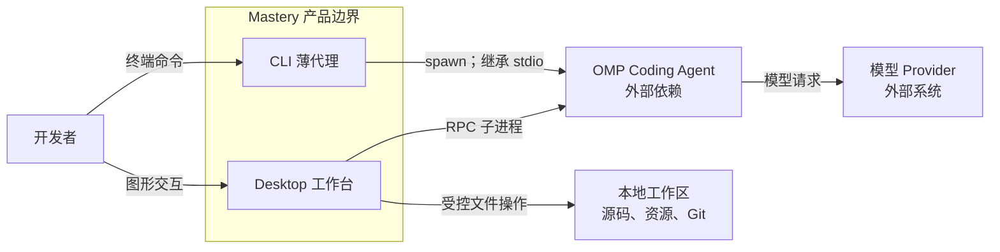

Mastery 有两条有意不同的执行路径：

1. CLI 在 `src/index.js` 中解析 OMP 可执行文件并透传参数、环境和 stdio。它不创建 `DesktopCore`。
2. Desktop 使用 Electron 进程模型，经 `OmpAdapter` 把 OMP RPC 帧转换成稳定的 RuntimeEvent，再交给 UI。

这种分离避免 CLI 为图形能力支付启动和依赖成本，也防止 Desktop UI 直接绑定第三方协议。

## 4. 容器视图

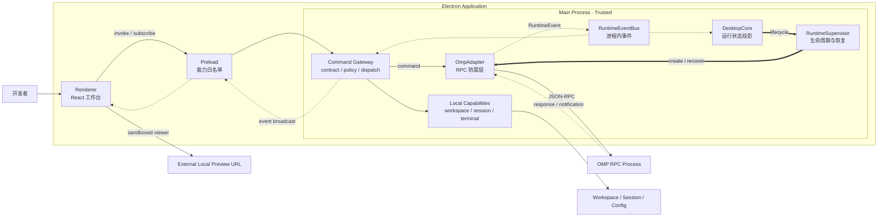

### 4.1 容器职责

| 容器 | 职责 | 拥有的状态 | 禁止承担 |
| --- | --- | --- | --- |
| Main Process | 启动编排、窗口、IPC、文件、会话、配置、终端、预览 | 特权资源句柄和应用生命周期 | 展示状态、React 业务逻辑 |
| Preload | 暴露最小且稳定的 `window.electronAPI` | 无持久业务状态 | 任意频道透传、业务编排 |
| Renderer | 展示、交互、短生命周期视图状态 | 当前布局、选择、流式展示模型 | Node/Electron 直接访问、工作区真相 |
| DesktopCore | Agent 生命周期和事件转发 | Core 状态、Engine 引用、有限事件缓冲 | UI 布局、文件展示 |
| OmpAdapter | OMP 子进程、RPC 关联、协议转换 | pending request、RPC buffer、session ID | Electron 或 React 逻辑 |
| RuntimeEventBus | 进程内发布订阅 | 订阅、有限历史/缓存 | 持久消息队列、跨进程一致性 |

## 5. 组件与依赖边界

### 5.1 Main / Runtime 组件

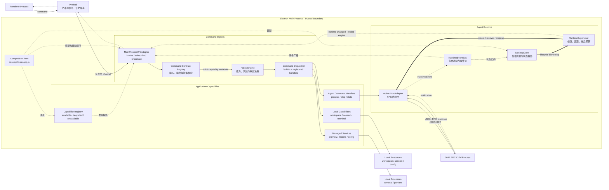

设计规则：

- `desktop/main-app.js` 是唯一应用组合根；只决定装配和启动顺序。
- 细实线表示同步命令路径，粗实线表示 Runtime 生命周期控制，虚线表示事件、状态发现或重新绑定；三者不得复用同一语义通道。
- 每个 Renderer command 必须依次通过 contract 校验和 policy 决策，再进入用例路由；未知 channel 默认拒绝。
- Command Dispatcher 统一承接内置 channel 与注册 handler；两类入口共享同一 contract/policy guard，但不承载 Runtime 状态机，也不解释 OMP 帧。
- Agent command 由 IPC Adapter 当前绑定的 Active Runtime 直接执行，不把 `DesktopCore` 或 `RuntimeSupervisor` 放进每次请求的热路径。
- `RuntimeSupervisor` 是 OMP Runtime 的唯一生命周期所有者；并发启动、异常退出、退避恢复和重启预算在此收敛，并在 Runtime 更换后重新绑定 IPC Engine。
- `OmpAdapter` 是第三方协议防腐层。OMP 原始帧不得越过该层。
- `DesktopCore` 只消费 RuntimeEvent、维护运行状态投影，不解释 Renderer 展示格式。
- RuntimeEvent 经 EventBus 单向广播到 IPC；Renderer 不通过反向查询拼装正在进行的事件序列。
- 工作区、会话、预览和配置是独立能力域；失败应限制在对应用例。

### 5.2 Renderer 组件

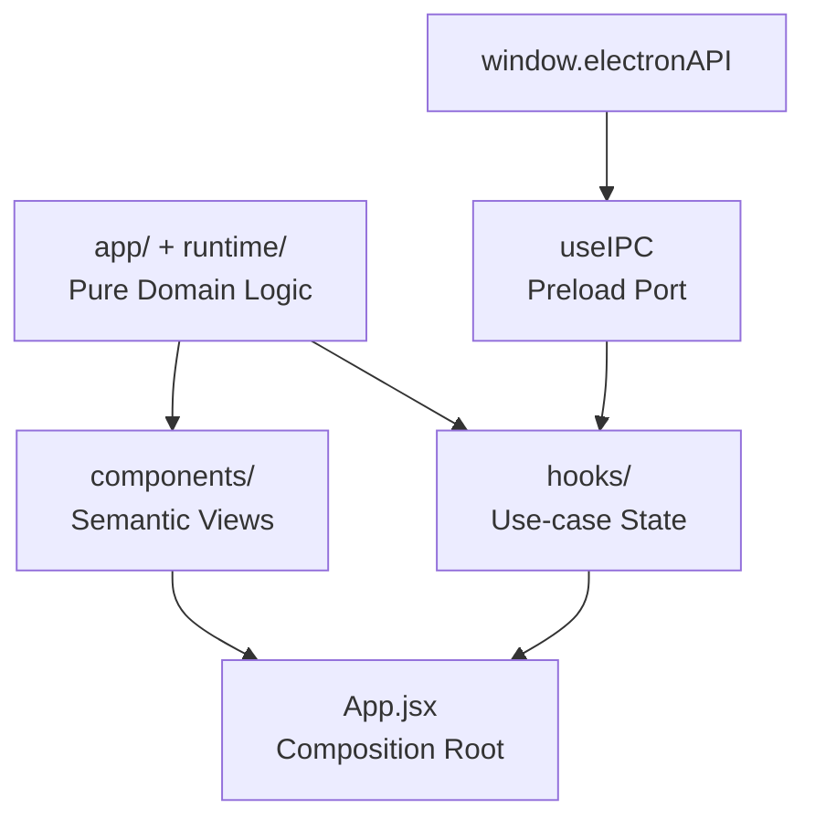

| 层 | 可以依赖 | 禁止依赖 |
| --- | --- | --- |
| `App.jsx` | Hooks、Views、纯领域服务 | Electron 主进程实现、OMP 原始对象 |
| `hooks/` | `app/`、`runtime/`、`useIPC` | `components/`、Main Process 文件 |
| `app/`、`runtime/` | 配置常量和纯函数 | React 组件、Electron、隐式 DOM 查询 |
| `components/` | 语义数据、回调、设计系统 | Node 内置模块、主进程模块 |
| `useIPC` | `window.electronAPI` | 白名单之外的能力 |

依赖只允许从稳定策略流向具体展示组合。Hooks 不得反向导入 Views；领域逻辑不得通过组件文件复用。

### 5.3 Message Presentation Graph

消息展示采用按用户意图归约的单向派生投影，而不是把 RuntimeEvent 逐条映射成气泡。一个 `ConversationTurn` 同时拥有 request、responses、tool runs 和 lifecycle；Assistant stream commit、查询、视图模式、可见性和滚动都必须从同一份 Message Display Graph 派生，不能形成平行消息管线。

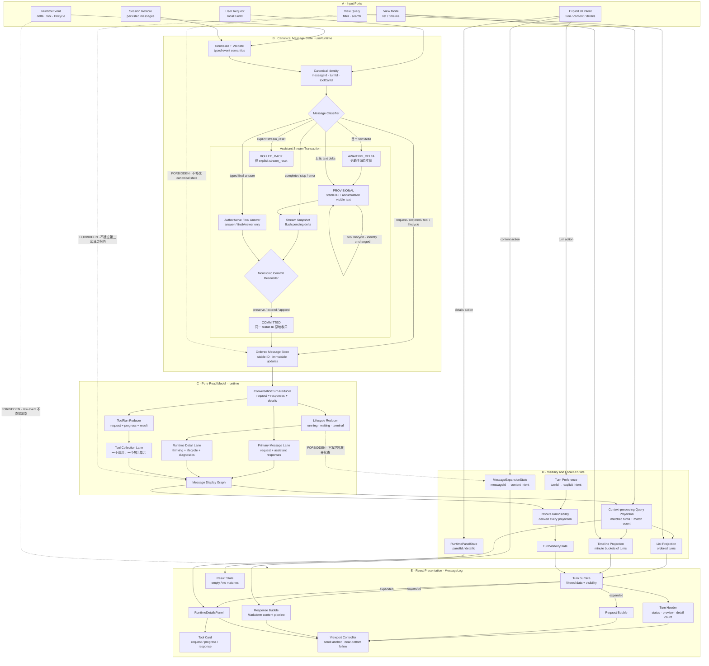

这张图定义五个工程边界：

| 边界 | 状态权威 | 允许写入者 | 展示职责 |
| --- | --- | --- | --- |
| Canonical Message State | `useRuntime.messages` | Runtime 归一化、Session Restore、用户请求 | 保存有序语义消息，不保存 JSX 或折叠状态 |
| Assistant Stream Transaction | stable message ID + accumulated text | text delta、terminal reconciler、explicit reset | 管理 provisional → committed，不创建重复 response |
| Message Display Graph | `runtime-details.js` / `message-graph.js` 纯投影 | 无持久写入者，每次从 canonical state 派生 | 聚合 Conversation Turn、Tool Collection、Lifecycle 和查询投影 |
| Visibility / Local UI State | Turn preference、message/panel expansion | 仅显式用户操作；Turn 默认值由纯策略派生 | 决定展示密度，不改变消息语义 |
| React Presentation | `MessageLog` / `RuntimeDetailsPanel` | 不拥有领域消息 | 渲染、键盘语义、预览、Markdown 和滚动锚点 |

其中 stream transaction 有两个关键不变量：

1. `CONTINUE`：工具事件可以改变 Tool Collection 和 Lifecycle Read Model，但不能清空 stream identity、删除消息或把 provisional response 提前晋升为另一个 response。
2. `MONOTONIC COMMIT`：terminal boundary 是完成确认，不是无条件替换快照。Reconciler 必须先 flush pending delta，以已经呈现的累计文本为基线；terminal answer 相同、为空或只是累计文本的子集时保留原文，只有提供新增信息时才扩展。输出不得比已呈现文本少，且必须复用原 stable ID。

权威最终答案只来自协议明确声明的 `answer` / `finalAnswer` 及其 result 等价字段；生命周期 payload 的通用 `content`、`text`、`message` 不能在 terminal 路径冒充最终答案。删除只属于显式 `stream_reset` 对协议已判定无效的 provisional 帧的回滚；`agent:complete`、`agent:stop`、`agent:error` 以及 ref/state 暂时不同步均没有删除已呈现消息的权限。因此该模型不依赖对 `·`、空格或其他字符做黑名单过滤。

前端显示还必须满足：

- `Context-preserving Query Projection` 是只读视图：查询命中 Turn 内任一 message/detail/tool 时保留完整 Turn 上下文，同时单独统计实际命中数。搜索、类型过滤和时间线切换不得删除消息、改变 Turn 状态或改写用户折叠偏好。
- List 和 Timeline 只能改变同一组匹配 Turn 的空间组织；Timeline 按 Turn 的稳定时间锚点分桶，禁止退回逐条 primary message 的第二套展示管线。
- Primary Message Lane 只展示用户请求和有语义内容的 assistant response；任务开始/结束、工具事件、思考和诊断统一进入 Runtime Detail Lane。
- Tool Card 从 Tool Collection Lane 接收聚合后的调用，不直接消费离散 request/result 事件。
- Viewport Controller 只管理滚动位置。near-bottom 自动跟随不能修改任何消息、Turn 或 expansion 状态；用户离开底部后必须保持阅读锚点。
- React key、折叠键、内容展开键分别使用稳定 message ID、turn ID 和 panel/detail ID；不得使用可因插入或过滤变化的数组位置作为长期身份。

折叠被拆成两个互不写入的状态域：`TurnVisibilityState` 决定整个 Conversation Turn 是否可见，`MessageExpansionState` 只决定单条长内容是否截断。前者允许生命周期派生默认值，后者完全属于显式用户意图。运行时事件只能成为 Turn Read Model 的输入，不能直接写任何 UI 折叠集合：

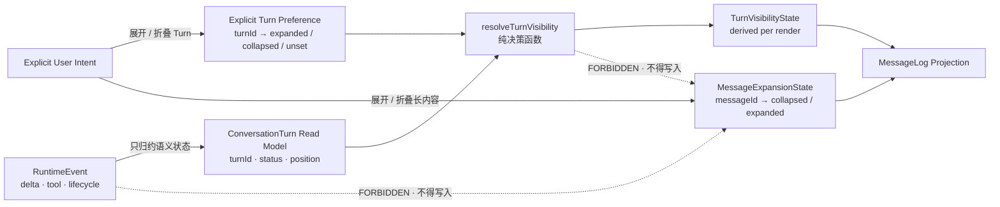

`TurnVisibilityState` 不是持久生命周期状态，而是一个无副作用的可见性决策。输入由 Turn 状态、用户偏好和上下文位置组成，并按固定优先级求值：

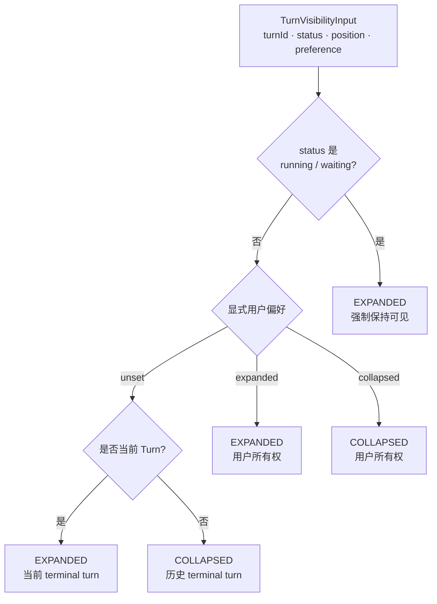

决策优先级从高到低为：需要交互的状态、显式用户偏好、当前上下文、历史默认值。`delta`、progress、搜索过滤和普通重渲染都不改变用户偏好；只有用户操作、Turn terminal 化或当前 Turn 发生切换时才可能改变 Turn 的派生可见结果。Turn terminal 化只触发 Turn 级求值，绝不能顺带折叠任意 Message。

| 投影对象 | 稳定关联键 | 归约规则 |
| --- | --- | --- |
| Message | message stable ID | 首个真实文本 delta 才创建 provisional 消息；tool call/result 不切断响应事务；terminal 通过单调归并提交同一消息，不能缩短或删除已呈现内容；只有显式 stream reset 回滚未呈现协议帧 |
| Conversation Turn | `turnId`，兼容 `runId` / `correlationId` | 同一用户意图的 request、responses、tools 和 lifecycle 归并到同一 turn |
| Legacy Conversation Turn | user message ID | 无关联字段时，下一条 user message 才开启新 turn；中间响应和详情属于当前 turn |
| Tool Collection | `toolCallId`，兼容 `callId` / activity ID | request、progress、result/error 归并为同一展示单元；无 ID 的同名调用使用独立 fallback instance |
| Turn Collapse State | turn ID | running/waiting 强制展开；其余状态先服从用户偏好，再按 current/historical 决定默认值 |
| Content Expansion State | message ID | 只接受显式用户操作，只控制长回答的内容截断；生命周期、响应完成和 Turn 策略都没有写权限 |

投影与折叠不变量：

- `agent:start`、无答案的 `agent:complete`、`agent:stop`、事件、思考、状态和工具生命周期属于 Runtime Detail Lane，不生成独立主消息气泡。
- 请求发出时不得推测性创建空助手消息。同一 Turn 的 assistant stream 跨越 tool call/progress/result 持续存在；`agent:complete` / `agent:stop` / `agent:error` 只能单调收口，不能以最后一个 assistant 片段覆盖累计 stream，也不能依据易失 ref 删除已呈现消息。只有协议层显式 `stream_reset` 才能回滚尚未形成可见内容的协议帧。
- 带最终答案的 `agent:complete` 保持为 response；生命周期详情附着到同一 Conversation Turn。
- 同一次工具调用的 request、progress、result/error 必须通过稳定调用 ID 聚合成一个 Tool Collection；响应不得脱离请求单独排列。
- running/waiting Conversation Turn 永不折叠。只有 terminal turn 集合或当前 Turn 发生变化时才重新求值，普通进度刷新不能改变历史 turn 的用户偏好。
- 自动历史折叠只允许发生在 Turn 层。`MessageExpansionState` 只能由用户点击写入；streaming → terminal、工具结果到达、新消息插入、搜索和重渲染均不得修改它。
- Turn collapse 与长内容 expansion 是两种正交状态；展开 Turn 不隐式展开或折叠内容，展开内容也不改变 Turn 偏好。两者都以稳定 ID 为键，禁止使用数组位置作为长期状态身份。
- Turn 归约与可见性策略位于 `runtime/runtime-details.js` 和 `runtime/message-graph.js` 的纯函数中；消息内容展开由 `MessageLog` 的显式交互状态持有。组件不得另建基于消息完成数量、签名变化或渲染次数的自动消息折叠规则。

### 5.4 Capability-driven UI Graph

Renderer 不再通过“方法是否存在”推断功能。连接完成后，`useCapabilities` 并行读取 `capabilities:list` 与 `contracts:list`，生成唯一 UI Read Model；所有特权入口从该投影派生。

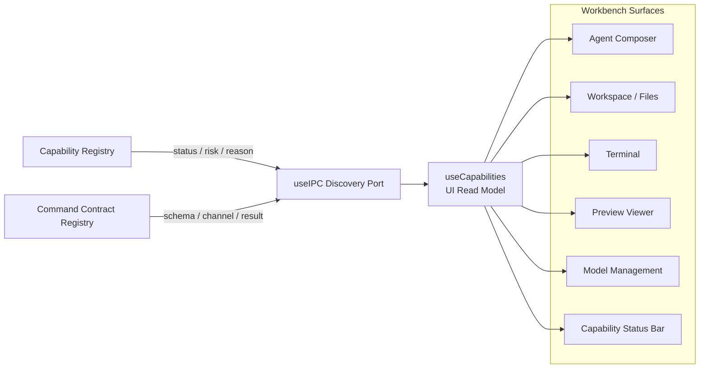

UI 投影规则：

- `available`：入口可操作。
- `degraded`：入口停止产生新 command，保留当前内容并展示恢复原因。
- `unavailable`：入口禁用；若能力本身不存在，不渲染伪造的运行状态。
- 未出现在 manifest 的特权能力默认 `unavailable`，即 UI fail closed。
- `preview.viewer` 与 `preview.process` 分离：本地 URL 查看器可用不代表应用拥有 Preview 子进程。
- Runtime 停止后重新读取 manifest，使自动恢复结果进入同一个 UI graph。
- 浏览器预览只启用 Renderer 本地能力，不模拟 Electron、文件、终端或 Agent 权限。

## 6. 关键运行时流程

### 6.1 Desktop 启动时序

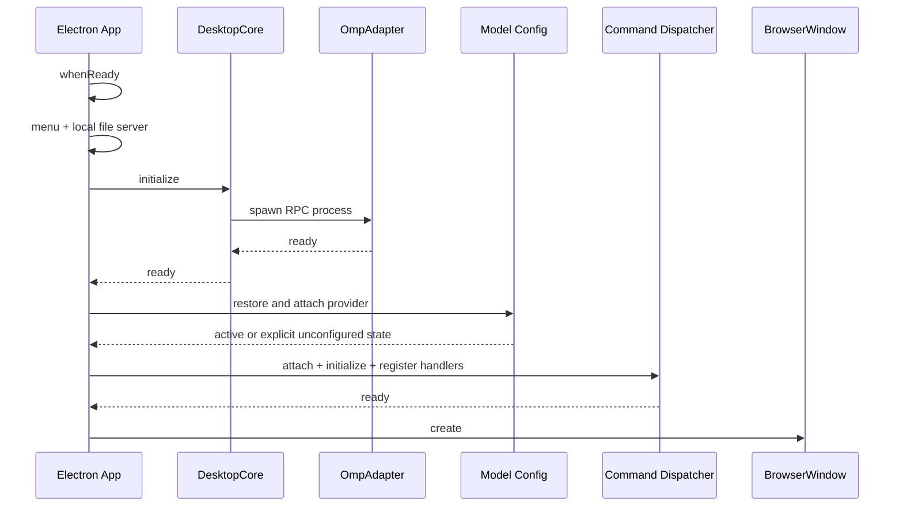

启动采用 fail-fast：

- Core、Provider 恢复和 IPC 注册在首个窗口创建前完成。
- `attachIPCAdapter` 只装配；异步 `initialize` 必须显式等待。
- 必要步骤失败时不创建半可用窗口，并释放已经创建的 Engine。
- 可选能力必须返回明确的 unavailable 状态，不能伪装为成功。

### 6.2 Agent 请求与流式响应

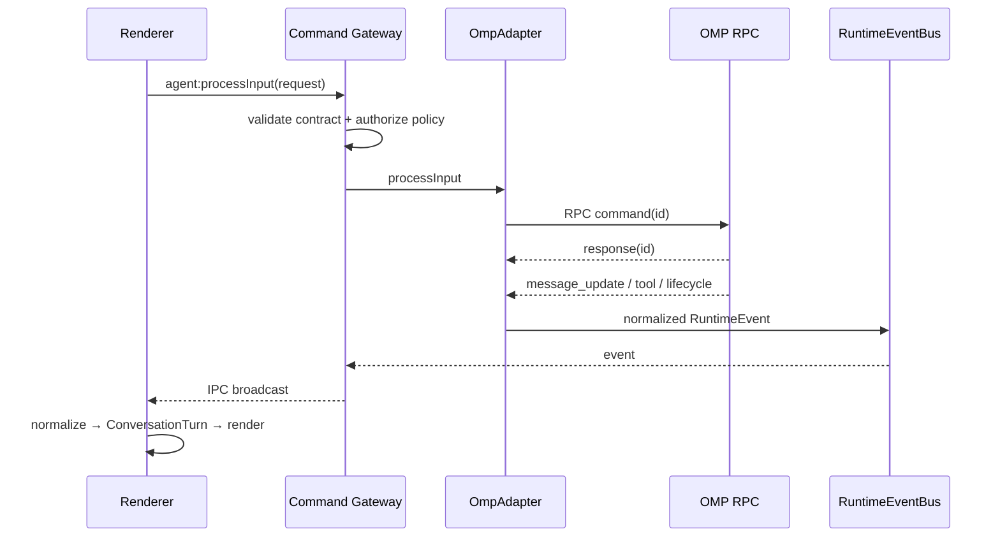

请求/事件语义：

- 命令使用 request ID 关联成功、失败和超时。
- RuntimeEvent 是异步事实，不与命令响应共享 exactly-once 保证。
- 文本 delta 允许批量交付；生命周期事件必须最终使 UI 离开 streaming 状态。
- 工具、计划和交互按稳定 ID 合并，不按到达顺序猜测身份。
- Renderer 重连后以 `agent:getState` 和会话数据重建状态，不依赖事件缓冲完整回放。

### 6.3 工作目录切换

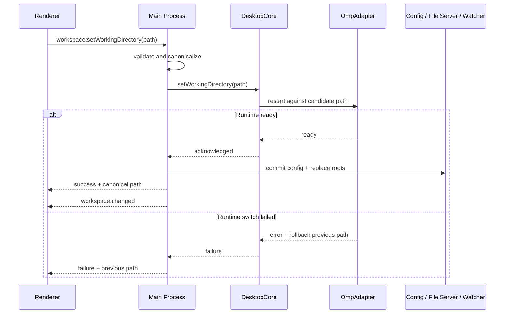

切换操作是一个有序用例，而不是多个组件各自修改路径。Runtime 必须先在候选目录恢复 ready，Main Process 才提交配置、文件服务和 watcher；Runtime 失败时 OmpAdapter 尝试恢复旧目录，且不得广播候选目录。配置文件或环境变量持久化失败不会回滚已成功切换的 Runtime，但必须通过 `persistenceError` 明确报告降级状态。

## 7. 状态、数据与一致性

### 7.1 状态所有权

| 状态 | 唯一权威 | 持久化 | 恢复策略 |
| --- | --- | --- | --- |
| Core 生命周期 | `DesktopCore` | 否 | 重新初始化 |
| OMP 执行与 Session ID | `OmpAdapter` / OMP | OMP 会话存储 | RPC 状态查询 |
| 会话目录和内容 | Session handlers / 文件系统 | 本地文件 | 列表重读，损坏项隔离 |
| 工作区文件 | 文件系统 | 本地文件 | 重新扫描/增量 watcher |
| 模型配置 | Main Process 配置模块 | 配置文件；密钥优先 `safeStorage` | 校验、迁移、安全默认值 |
| UI 布局 | `useLayout` | localStorage | schema 归一化和范围约束 |
| Runtime 展示模型 | `useRuntime` | 会话按需保存 | 状态查询 + 会话重载 |
| Preview 能力 | Capability Registry | 否 | 当前明确报告 `unavailable`，可连接外部本地 URL |

一致性模型：

- 文件系统和 OMP Session 是权威数据；Renderer cache 是可丢弃投影。
- IPC 命令采用 request/response；RuntimeEvent 采用 at-most-once 的实时通知语义。
- EventBus 事件缓冲上限由 `DESKTOP_ARCHITECTURE_LIMITS.eventBufferSize` 定义，当前为 1000 条，只用于诊断，不是恢复日志。
- localStorage 数据必须在 Hook 使用前完成版本兼容、枚举校验和数值约束。
- 跨域更新不得通过隐式 DOM、全局可变对象或重复 localStorage key 协调。

### 7.2 Event Envelope v1

```text
RuntimeEventEnvelope {
  type: string
  id: string
  schemaVersion: 1
  timestamp: epoch-milliseconds
  source: string
  sequence?: integer
  correlationId?: string
  causationId?: string
  ...payload
}
```

- `id` 标识单个事件；`correlationId` 标识一次用户意图或 Agent run；`causationId` 指向直接触发者。
- `sequence` 只保证同一个 EventBus 实例内单调递增，不代表跨进程或跨重启的全局顺序。
- 新增可选 metadata 是向后兼容变更；删除字段、改变含义或 payload 结构必须提升 schema version。
- 消费者必须忽略未知 metadata，不能用对象字段完全相等判断兼容性。
- Envelope 是可观测性和协议演进的基础，不等于持久事件溯源。

### 7.3 内容显示管线

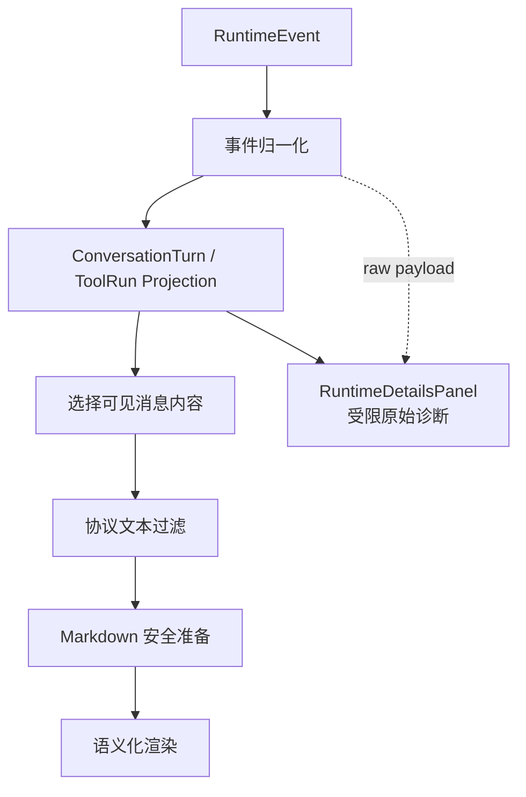

- Runtime 归一化层决定事件含义，纯领域投影决定消息归属，组件只决定如何展示。
- `stripToolProtocolText` 是协议文本过滤的唯一实现。
- `prepareMarkdownDisplay` 负责链接、工作区图片、流式 fence 和安全文本准备。
- fenced code 不参与普通正文自动转换；原始 payload 只进入诊断详情。
- 折叠内容在进入 Markdown parser 前裁剪；完整历史仍保留在 Renderer messages 中。当前没有列表虚拟化和硬上限，这是已知容量限制。
- 消息的主从分流、工具请求/响应配对和折叠决策遵循 [Message Presentation Graph](#53-message-presentation-graph)，不在 Markdown 层重复实现。

## 8. 安全架构

### 8.1 信任边界

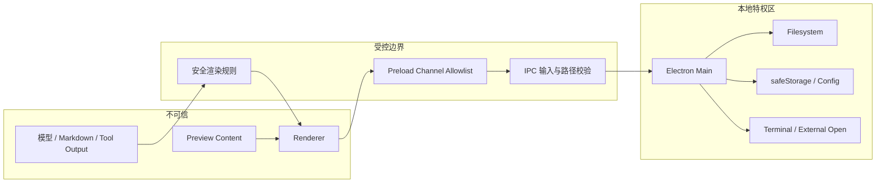

安全不变量：

1. BrowserWindow 强制 `nodeIntegration: false`、`contextIsolation: true`、`sandbox: true`、`webSecurity: true`。
2. Preload 只暴露显式 invoke/send/receive 白名单；Renderer 不获得原始 `ipcRenderer`。
3. 文件路径必须相对已选择工作区解析并防止目录穿越。
4. `openExternal` 只接受 `http:` 和 `https:`。
5. 模型密钥优先使用 Electron `safeStorage`；日志和诊断不得包含密钥、Authorization header 或完整配置。
6. Preview iframe 使用 sandbox；预览内容不能继承 Main Process 权限。
7. 终端执行属于高风险能力，授权与命令边界必须在 Main Process 执行，不能只依赖 UI 禁用态。

## 9. 可靠性、容量与可观测性

### 9.1 故障隔离

| 故障 | 隔离范围 | 系统响应 | 恢复路径 |
| --- | --- | --- | --- |
| OMP 启动失败 | Agent Runtime | Core 进入 `error`，不创建窗口 | 显式重试初始化 |
| OMP 运行中退出 | 当前运行 | Supervisor 进入 degraded、释放旧 Runtime 并拒绝失效请求 | 在重启预算内自动恢复并重绑 IPC；预算耗尽后显式重启 |
| IPC 初始化失败 | Desktop 启动 | fail-fast，不创建半可用窗口 | 修复后重启 |
| Preload 不可用 | 当前 Renderer | 显示能力不可用诊断 | 重载窗口 |
| React 渲染异常 | Renderer 树 | `UIErrorBoundary` 隔离 | 重试或重载 |
| 单个文件/预览/RAG 操作失败 | 当前能力 | 局部错误，不终止 Agent | 重试该操作 |
| localStorage 损坏 | 单个 UI 状态域 | 丢弃非法值并使用默认值 | 自动恢复 |

### 9.2 容量预算

| 资源 | 当前边界 | 超限行为 | 备注 |
| --- | --- | --- | --- |
| Desktop 诊断事件缓冲 | 1000 条 | 丢弃最旧事件 | 非持久恢复机制 |
| IPC request | 默认 30 秒 | reject timeout | 长任务依赖事件流，不延长同步请求 |
| IPC 重连 | 默认 5 次、1 秒退避 | 进入断开状态 | 当前不是指数退避 |
| Renderer 消息列表 | 未设硬上限 | 默认折叠历史 terminal turn 降低展示密度 | 尚未虚拟化；单条消息内容折叠不是容量回收机制 |
| 单主窗口 | 1 个主要工作台 | 不定义跨窗口同步 | 多窗口是未来架构议题 |

容量值必须来自实现常量或配置，不允许只存在于文档。调整预算时要同时更新代码、测试和本表。

### 9.3 可观测性

- 生命周期状态：`idle → initializing → ready ↔ running → error/disposed`。
- 诊断接口：`ipc:diagnose` 仅返回版本、路径存在性、连接状态、窗口身份和 handler 统计。
- Runtime 指标：事件、请求、错误和连接统计通过显式 snapshot 查询。
- 日志必须带边界上下文，但不得记录 secret 或完整敏感 payload。
- Event Envelope 已提供 correlation/causation 承载位，Renderer 也为本地请求分配稳定 `turnId`；但上下文尚未端到端贯通 IPC command、OMP RPC 和所有工具调用，当前也没有持久日志管线和崩溃遥测。

## 10. 部署与发布视图

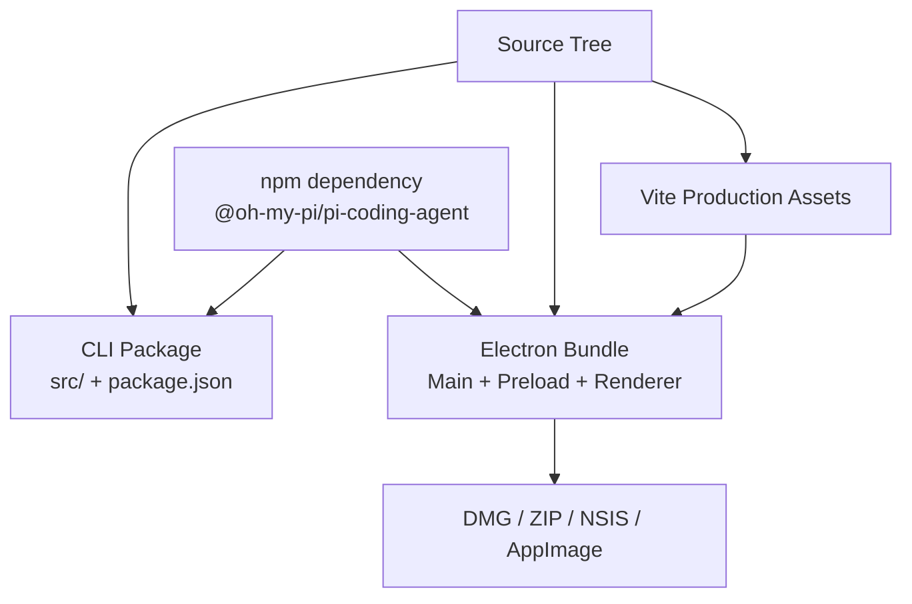

- CLI 和 Desktop 共享发布仓库与 OMP 依赖，但入口和生命周期独立。
- Renderer 由 Vite 产出静态资源，打包进 Electron 应用。
- Desktop 包必须包含 sandbox-compatible CommonJS Preload。
- `bun run verify` 是提交前统一门禁；平台安装包由独立发布脚本生成。

## 11. 架构决策

| ID | 决策 | 原因 | 代价 / 触发复审条件 |
| --- | --- | --- | --- |
| ADR-001 | CLI 直接代理 OMP，不复用 DesktopCore | 启动轻、stdio 原生、避免 Electron 依赖 | CLI/Desktop 行为可能漂移；需要共享业务能力时复审 |
| ADR-002 | OMP 以 RPC 子进程接入 | 故障隔离、协议边界清晰、可替换 | 有序关闭、超时和进程恢复更复杂 |
| ADR-003 | RuntimeEvent Envelope v1 作为稳定事件语言 | 隔离 OMP 原始帧，提供版本、顺序和因果上下文 | metadata 需逐步贯通各边界；不提供持久重放 |
| ADR-004 | Preload 白名单是唯一 Renderer 特权端口 | 降低 Electron 攻击面 | 新能力必须同时更新 Preload、handler 和测试 |
| ADR-005 | 文件系统是工作区和会话真相来源 | 本地优先、可检查、无服务端依赖 | 不支持跨设备一致性 |
| ADR-006 | Renderer 使用 Hooks + 纯领域模块，不引入全局状态框架 | 当前规模下依赖透明、测试简单 | 状态图出现循环或跨页面事务时复审 |
| ADR-007 | 事件缓冲仅用于有限诊断 | 控制内存且避免伪装成可靠队列 | 需要崩溃恢复/离线重放时引入持久事件日志 |
| ADR-008 | IPC command 默认 fail closed | 未注册 contract 的命令不得进入 handler | 新 channel 必须同时声明 payload、result 和 risk |
| ADR-009 | 长驻 OMP 由 Runtime Supervisor 管理 | 将异常退出、恢复预算和 Engine 重绑集中到一处 | 一次性 Terminal command 使用超时终止；Preview runner 当前不存在 |
| ADR-010 | Policy Engine 是 command 的统一决策点 | 权限不依赖 Renderer 状态，且保留有限决策审计 | 默认 `local-full` 兼容现有本地体验；企业策略需新增 profile |

任何改变进程边界、状态权威、IPC 语义、安全不变量或一致性模型的修改，都必须新增或更新 ADR。

## 12. 已知限制与演进路线

| 优先级 | 限制 | 风险 | 演进方向 |
| --- | --- | --- | --- |
| P1 | 默认策略 profile 是 `local-full`，尚无逐次用户授权界面 | 本地高风险 command 默认允许 | 增加交互式 consent rule 和团队策略 profile |
| P2 | `App.jsx` 仍是较大的组合根 | 跨域编排继续增长 | 按 Workbench capability 拆分 feature controller |
| P2 | 消息列表未虚拟化 | 超长会话渲染成本增长 | 引入测量型虚拟列表并保持锚点 |
| P2 | correlation/causation 仅部分贯通 | Renderer Turn 可以稳定聚合，但跨 IPC、OMP 和日志排障仍需人工关联 | Command、RPC、RuntimeEvent 和 Tool run 继承同一上下文 |
| P3 | localStorage 不支持多窗口和跨设备一致性 | 未来扩展受限 | 引入版本化本地状态仓库；需求明确后再同步 |

演进优先修复安全与恢复边界，不以增加抽象层数量作为“架构升级”。只有当当前约束被真实需求突破时，才引入新进程、队列或状态框架。

## 13. 变更闭环

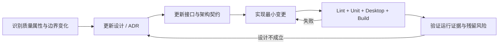

| 变更类型 | 必须检查 | 最低证据 |
| --- | --- | --- |
| Core / OmpAdapter | 状态转换、并发初始化、失败清理、dispose | 生命周期单测 + Desktop 测试 |
| IPC / Preload | 白名单、输入校验、handler 对称性、错误传播 | IPC 契约 + Desktop 安全测试 |
| RuntimeEvent | 命名、payload、顺序容忍、流式收口 | RuntimeEvent 单测 |
| Renderer 领域 | 单向依赖、纯转换、异常输入 | 边界测试 + 对应单测 |
| UI / Design | 语义、键盘、主题、窄窗口、错误态 | 设计契约 + 构建 + 视觉检查 |
| 状态 / 配置 | 权威归属、迁移、损坏数据、secret | 归一化与安全存储测试 |
| 架构边界 | 本文、ADR、预算和实现常量 | `architecture-contract.test.js` |

本地统一命令：

```bash
bun run verify
```

`verify` 固定执行 ESLint、Renderer 生产构建、全部单元测试和 Desktop 测试。架构契约测试位于单元测试目录，因此自动纳入门禁。

## 14. 实现索引

| 设计元素 | 实现位置 |
| --- | --- |
| CLI 薄代理 | `src/index.js` |
| Desktop 生命周期 | `src/adapters/desktop/desktop-core.js` |
| OMP 防腐层 | `src/adapters/desktop/omp-adapter.js` |
| Event Envelope | `src/runtime/event-bus/records.js` |
| Command Contract Registry | `src/adapters/desktop/protocol/command-contracts.js` |
| Runtime Supervisor | `src/adapters/desktop/runtime-supervisor.js` |
| Capability Registry | `src/adapters/desktop/capability-registry.js` |
| Policy Engine | `src/adapters/desktop/policy-engine.js` |
| IPC 公共适配器入口 | `src/adapters/desktop/ipc-adapter.js` |
| Main Command Gateway | `src/adapters/desktop/ipc/main-process-adapter.js` |
| Main handler 注册与能力路由 | `desktop/main-app/ipc-router.js` |
| 工作目录切换事务 | `desktop/main-app/workspace-file-server.js` |
| 安全 Preload | `desktop/preload.cjs` |
| Renderer 组合根 | `desktop/renderer/App.jsx` |
| Renderer 特权端口 | `desktop/renderer/hooks/useIPC.js` |
| UI Capability Read Model | `desktop/renderer/hooks/useCapabilities.js` |
| UI Capability Graph | `desktop/renderer/app/capabilities/capability-graph.js` |
| Message Display Graph / 折叠策略 | `desktop/renderer/runtime/message-graph.js` |
| 消息分组 / 工具与生命周期投影 | `desktop/renderer/runtime/runtime-details.js` |
| 消息展示组合 | `desktop/renderer/components/MessageLog.jsx` |
| Runtime 详情展示 | `desktop/renderer/components/message-log/RuntimeDetailsPanel.jsx` |
| 布局领域 | `desktop/renderer/app/layout/layout-state.js` |
| 内容管线 | `desktop/renderer/app/content/content-pipeline.js` |
| 架构契约 | `tests/unit/architecture-contract.test.js` |
